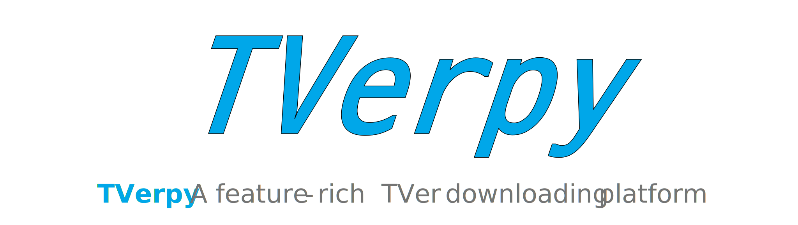
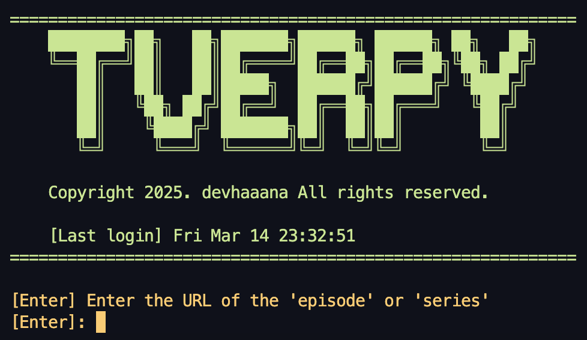

<div align="center">

  [](#readme)
  [](LICENSE "License")
  [](#release-files "Release Files")
  [](https://github.com/devhaaana/tver-downloader/commits "Commit History")
  [](https://github.com/devhaaana/tver-downloader/pulse/monthly "Last Commit")

</div>

<br />

<div align="center">

[ENGLISH](/README.md)  ·  [한국어](/documents/README-KR.md)  ·  [日本語](/documents/README-JP.md)

</div>

<br />

`Tver-Downloader` can record the [tver.jp](https://tver.jp/) programs outside of Japan.

## Index
- [Index](#index)
- [Architecture](#architecture)
- [Warning](#warning)
- [Technologies](#technologies)
- [Getting Started](#getting-started)
  - [Installation](#installation)
  - [Usage](#usage)
- [Release Files](#release-files)

## Architecture

```
tver-downloader
├─ LICENSE
├─ README.md
├─ documents
│  ├─ README-JP.md
│  └─ README-KR.md
├─ images
│  ├─ banner.svg
│  └─ sample
│     └─ base-ui.png
├─ main.py
├─ requirements.txt
├─ tver.py
└─ utils.py
```

## Warning

**Please do not use this project for commercial use. Only for your personal, non-commercial use.**

## Technologies

- `Python` : 3.12
- `FFmpeg`

## Getting Started

### Installation

- You can install it **locally:**

  ```bash
  git clone https://github.com/devhaaana/tver-downloader.git
  cd tver-downloader
  ```

- Make sure you have **Python** installed on your system. Then, install the **required packages** by running the following command:

  ```bash
  conda create -n tver_env python=3.12
  conda activate tver_env
  pip install -r requirements.txt
  ```

- Due to the addition of DRM to TVer, a Japanese **VPN** or **proxy server** is required.

### Usage

```bash
python main.py
```



## Release Files

| File                                                                                   | Description                                                       |
| -------------------------------------------------------------------------------------- | ----------------------------------------------------------------- |
| [tver-downloader-1.0.0.zip](https://github.com/devhaaana/tver-downloader/archive/refs/tags/v1.0.0.zip)       | A*ZIP* file containing the full source code of tver-downloader v1.0.0.    |
| [tver-downloader-1.0.0.tar.gz](https://github.com/devhaaana/tver-downloader/archive/refs/tags/v1.0.0.tar.gz) | A*TAR.GZ* file containing the full source code of tver-downloader v1.0.0. |

<br />

<div align="center">
  
  [](https://hits.seeyoufarm.com)

</div>
